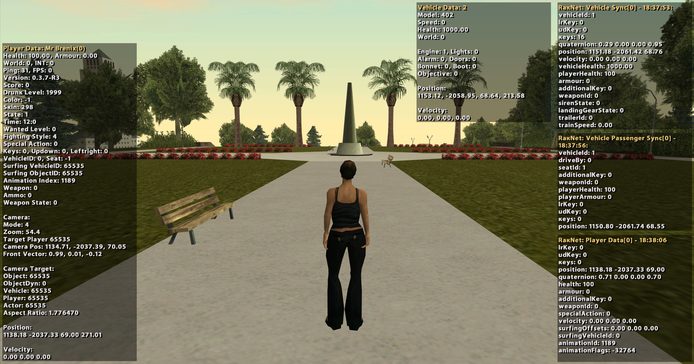
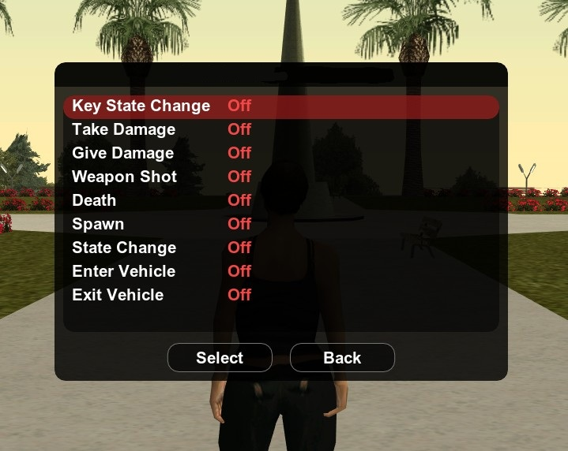
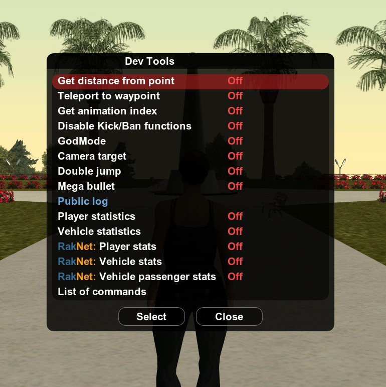
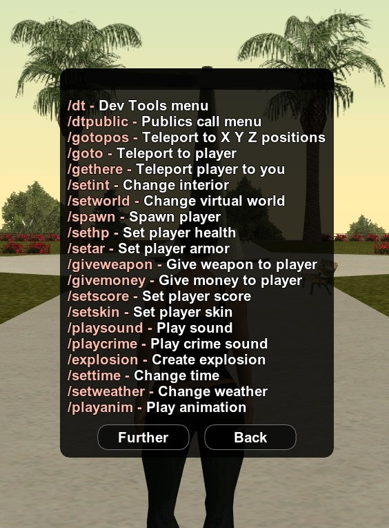

# devTools

The Dev Tools library is a tool for SA-MP (Pawn) developers, designed for debugging, monitoring, and simplifying the gamemode testing process.

## Reference
* [Installation](#installation)
* [Commands](#commands)
* [Functions](#functions)
* [Definition](#definition)


# Features

### Monitoring and Statistics
Allows displaying important metrics via TextDraw:

- Player: Health, position, weapons, ping, and other data.
- Vehicle: Speed, position, status, and ID.



### Event Debugging
Tracking events for specific players:

- Animation index, key presses, receiving/inflicting damage.
- Shots, deaths, spawn.
- Entering/exiting and changing vehicle status.



### Testing Tools
The library includes built-in functions to facilitate movement and mechanic testing:

- Teleport to a map waypoint.
- GodMode.
- Measuring distance to a point.



### Editors
- Tool for configuring player-attached objects (bone and model selection).
- Object management (creation, editing, export, import).

## Installation

Include in your code and begin using the library:
```pawn
#include <devTools\devTools>

public OnPlayerSpawn(playerid) { 
	
    SetAccessDevTools(playerid, 1);
    return 1;
}
```

## Commands



### Player commands

| Command           | Description                    | Aliase      |
| ----------------- | ------------------------------ | ----------- |
| `dt`				| Dev Tools menu                 | `devTools`, `dtools` |
| `dtpublic	`		| Publics call menu              | `dtpub` |
| `gotopos`			| Teleport to X Y Z positions    | `tppos` |
| `goto`		    | Teleport to player             | `gotp` |
| `gethere`			| Teleport player to you         | `geth` |
| `setint`			| Change interior                | `setinterior` |
| `setworld`		| Change virtual world           | |
| `spawn`			| Spawn player                   | `setspawn` |
| `sethp`			| Set player health              | `sethealth` |
| `setar`			| Set player armor               | `setarmour` |
| `giveweapon`		| Give weapon to player          | `givegun`, `setweapon`, `aweapon` |
| `givemoney`		| Give money to player           | `setmoney` |
| `setscore`		| Set player score               | |
| `setskin`			| Set player skin                | |
| `playsound`		| Play sound                     | `setsound` |
| `playcrime`		| Play crime sound               | `setcrime` |
| `explosion`		| Create explosion               | `boom`, `setexplosion` |
| `settime`			| Change time                    | `worldtime` |
| `setweather`		| Change weather                 | `setwea` |
| `playanim`		| Play animation                 | `setanim`, `playanimation`, `setanimation` |
| `getcam`			| Get current camera position    | `camerapos`, `campos` |
| `attedit`			| Create attached object         | `setattach` |
| `setaction`		| Set special action             | `saction`, `specialaction` |
| `startrecord`		| Start bot recording            | |
| `stoprecord`		| Stop bot recording             | |
| `fstyle`			| Set fighting style             | `fightstyle` |
| `setdrunk`		| Set drunk level                | `setdrunklevel`, `drunklevel` |
| `weaponskill`		| Set weapon skill level         | `setweaponskill` |
| `setwanted`		| Set wanted level               | `setwantedlevel` |
| `cursor`			| Show cursor                    | `tdselect` |

### Vehicle Commands

| Command           | Description                    | Aliase      |
| ----------------- | ------------------------------ | ----------- |
| `veh`             | Create vehicle                 | `acar`, `createveh`, `cvhe` | 
| `delveh`          | Delete vehicle                 | `dveh` | 
| `repairveh`       | Repair vehicle                 | `fixcar` | 
| `setvehhp`        | Set vehicle health             | `setvhp` | 
| `gotoveh`         | Teleport to vehicle            | `tpveh` | 
| `gethereveh`      | Teleport vehicle to you        | `getveh` | 
| `setvehcolor`     | Change vehicle color           | `vcolor`, `setvc` | 
| `setcomp`         | Install tuning component       | `setcomponent`, `vcomponent`, `vcomp` | 
| `remcomp`         | Remove tuning component        | `remcomponent`, `delcomp` | 
| `vehen`           | Start/stop engine              | `vehengine`, `vehicleengine` | 
| `vehli`           | Turn on/off lights             | `vehlights`, `vehiclelights` | 
| `vehdo`           | Open/close doors               | `vehdoor`, `vehicledoor` |


### Object Commands

| Command           | Description                           | Aliase      |
| ----------------- | ------------------------------------- | ----------- |
| `loadmap`  		| Load map                              | `loadproject` |
| `savemap`  		| Save map                              | `saveproject` |
| `ocreate`  		| Create object                         | `ocre`, `cobject` |
| `odel`  			| Delete object                         | `delo`, `dobject`, `delobj` |
| `odelall`  		| Delete all objects                    | `delallo` |
| `oedit`  			| Edit object                           | `edito`, `editobject` |
| `oselect`   		| Select object with cursor             | |
| `ocopy`  			| Copy object                           | |
| `ogoto`  			| Teleport to object                    | |
| `ogethere`  		| Teleport object to you                | |
| `oinfo`  			| Object information                    | |
| `otextdis`  		| Set 3D text distance                  | |
| `otextdetal`  	| Display detailed info about objects   | |
| `oworld`   		| Set virtual world for object          | |
| `oworldall`  		| Set virtual world for all objects     | |
| `oint`   			| Set interior for object               | |
| `ointall`   		| Set interior for all objects          | |
| `odis`   			| Set distance for object               | |
| `odisall`   		| Set distance for all objects          | |
| `osetm`   		| Set material                          | |
| `osetmt`   		| Set text material                     | `mtset` |
| `ormt`   			| Remove material                       | `rindex` |
| `ormtt`   		| Remove text material                  | `robject` |
| `ox`   			| Set X position                        | |
| `oy`   			| Set Y position                        | |
| `oz`   			| Set Z position                        | |
| `orx`   			| Set RX rotation                       | |
| `ory`   			| Set RY rotation                       | |
| `orz`  			| Set RZ rotation                       | |
| `oxall`  			| Set X position for all objects        | |
| `oyall`  			| Set Y position for all objects        | |
| `ozall`  			| Set Z position for all objects        | |


## Functions
#### SetAccessDevTools(playerid, status)
> Assigns a specific access status to a player
> * `playerid` - The ID of the player
> * `status` - The access level value to set (0 for disabled, 1 for enabled).

#### GetAccessDevTools(playerid)
> Retrieves the current access status of a player
> * `playerid` - The ID of the player
> * Returns the current `status`


## Definition
<details>
<summary>Click to expand the list</summary>

```pawn
#define DT_DISABLE_COMMANDS
#define DT_DISABLE_OBJECT_EDITOR
#define DT_ENABLE_IGNORE_PUNISHMENTS

#define DT_INTERFACE_LANGUAGE 0 // 0 - English | 1 - Russian 

#define DT_MIN_VEHICLE_MODEL 400
#define DT_MAX_VEHICLE_MODEL 611
#define DT_MIN_SKIN_MODEL 0
#define DT_MAX_SKIN_MODEL 311
#define DT_VEHICLE_SPEED_MULTIPLIER 179.28625

#define DT_MAX_OBJECT 200 // Maximum number of objects that can be created
#define DT_OBJECTS_FOLDER "devTools_Maps"
#define DT_LENGTH_PROJECT_NAME 32
```

</details