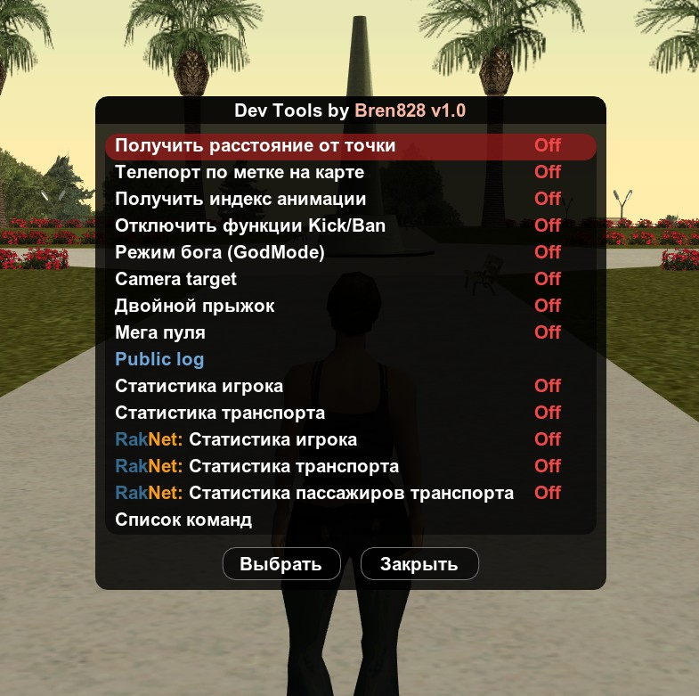
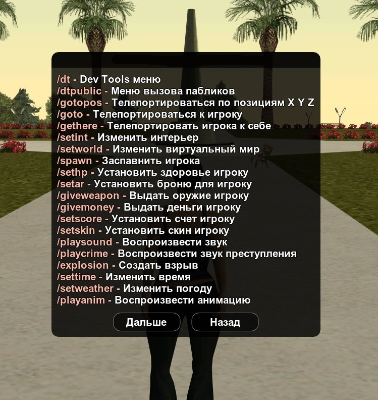

# devTools

> [English](README.md) | [Русский](README.ru.md)

Библиотека Dev Tools — это инструмент для разработчиков SA-MP (Pawn), предназначенный для отладки, мониторинга и упрощения процесса тестирования игровых режимов.

## Содержание
* [Установка](#установка)
* [Команды](#команды)
* [Функции](#функции)
* [Определение](#определение)

# Features

### Мониторинг и статистика
Позволяет отображать важные показатели с помощью TextDraw:

- Игрок: здоровье, положение, оружие, пинг и другие данные.
- Транспортное средство: скорость, положение, статус и ID.


### Отладка
Отслеживание событий для конкретных игроков:

- Индекс анимации, нажатия клавиш, получение/нанесение урона.
- Выстрелы, смерти, возрождение.
- Вход/выход из транспортного средства и изменение его состояния.


### Инструменты
Функции для упрощения перемещения и тестирования механики:

- Телепортация к точке на карте.
- Режим Бога.
- Измерение расстояния до точки.
- Отключение функций наказания (Kick, Ban).
- Двойной прыжок.
- Мега пуля (Стрельба фзрывами)



### Редакторы
Встроенные функции редактирования объектов

- Инструмент для настройки объектов, прикрепленных к игроку (выбор костей и модели).
- Управление объектами (создание, редактирование, экспорт, импорт).

## Установка

Включите эту библиотеку в свой код и начните её использовать:
```pawn
#include <devTools\devTools>

public OnPlayerSpawn(playerid) { 
	
    SetAccessDevTools(playerid, 1);
    return 1;
}
```

## Команды

Изначально все команды имеют префикс `dt` во избежание конфликтов имен.
После запуска сервера они переименовываются с помощью функции `PC_RenameCommand`, при условии, что команда еще не зарегистрирована.



### Команды игроков

| Команда           | Описание                              | Псевдоним   |
| ----------------- | ------------------------------------- | ----------- |
| `dt`				| Dev Tools меню                        | `devTools`, `dtools` |
| `dtpublic	`		| Меню вызова пабликов                  | `dtpub` |
| `gotopos`			| Телепортироваться по позициям X Y Z   | `tppos` |
| `goto`		    | Телепортироваться к игроку            | `gotp` |
| `gethere`			| Телепортировать игрока к себе         | `geth` |
| `setint`			| Изменить интерьер                     | `setinterior` |
| `setworld`		| Изменить виртуальный мир              | |
| `spawn`			| Заспавнить игрока                     | `setspawn` |
| `sethp`			| Установить здоровье игроку            | `sethealth` |
| `setar`			| Установить броню для игроку           | `setarmour` |
| `giveweapon`		| Выдать оружие игроку                  | `givegun`, `setweapon`, `aweapon` |
| `givemoney`		| Выдать деньги игроку                  | `setmoney` |
| `setscore`		| Установить счет игроку                | |
| `setskin`			| Установить скин игроку                | |
| `playsound`		| Воспроизвести звук                    | `setsound` |
| `playcrime`		| Воспроизвести звук преступления       | `setcrime` |
| `explosion`		| Создать взрыв                         | `boom`, `setexplosion` |
| `settime`			| Изменить время                        | `worldtime` |
| `setweather`		| Изменить погоду                       | `setwea` |
| `playanim`		| Воспроизвести анимацию                | `setanim`, `playanimation`, `setanimation` |
| `getcam`			| Получить текущее положение камеры     | `camerapos`, `campos` |
| `attedit`			| Создать прикрепленный объект          | `setattach` |
| `setaction`		| Установить специальное действие       | `saction`, `specialaction` |
| `startrecord`		| Начать запись бота                    | |
| `stoprecord`		| Остановить запись бота                | |
| `fstyle`			| Установить стиль боя                  | `fightstyle` |
| `setdrunk`		| Установить уровень опьянения          | `setdrunklevel`, `drunklevel` |
| `weaponskill`		| Установить уровень владения оружием   | `setweaponskill` |
| `setwanted`		| Установить уровень розыска            | `setwantedlevel` |
| `cursor`			| Показать курсор                       | `tdselect` |

### Команды транспорта

| Команда           | Описание                          | Псевдоним   |
| ----------------- | --------------------------------- | ----------- |
| `veh`             | Создать автомобиль                | `acar`, `createveh`, `cvhe` | 
| `delveh`          | Удалить автомобиль                | `dveh` | 
| `repairveh`       | Ремонт автомобиля                 | `fixcar` | 
| `setvehhp`        | Установить здоровье автомобиля    | `setvhp` | 
| `gotoveh`         | Телепортироваться к транспорту    | `tpveh` | 
| `gethereveh`      | Телепортировать транспорт к себе  | `getveh` | 
| `setvehcolor`     | Изменить цвет транспорта          | `vcolor`, `setvc` | 
| `setcomp`         | Установить компонент тюнинга      | `setcomponent`, `vcomponent`, `vcomp` | 
| `remcomp`         | Снять компонент тюнинга           | `remcomponent`, `delcomp` | 
| `vehen`           | Запустить/заглушить двигатель     | `vehengine`, `vehicleengine` | 
| `vehli`           | Включить/включить фары            | `vehlights`, `vehiclelights` | 
| `vehdo`           | Открыть/закрыть двери             | `vehdoor`, `vehicledoor` |


### Команды объектов

| Команда           | Описание                                      | Псевдоним   |
| ----------------- | --------------------------------------------- | ----------- |
| `loadmap`  		| Загрузить карту                               | `loadproject` |
| `savemap`  		| Сохранить карту                               | `saveproject` |
| `ocreate`  		| Создать объект                                | `ocre`, `cobject` |
| `odel`  			| Удалить объект                                | `delo`, `dobject`, `delobj` |
| `odelall`  		| Удалить все объекты                           | `delallo` |
| `oedit`  			| Редактировать объект                          | `edito`, `editobject` |
| `oselect`   		| Выбрать объект курсором                       | |
| `ocopy`  			| Копировать объект                             | |
| `ogoto`  			| Телепортироваться к объекту                   | |
| `ogethere`  		| Телепортировать объект к себе                 | |
| `oinfo`  			| Информация об объекте                         | |
| `otextdis`  		| Установить расстояние 3D текста               | |
| `otextdetal`  	| Отобразить подробную информацию о объектах    | |
| `oworld`   		| Установить виртуальный мир объекту            | |
| `oworldall`  		| Установить виртуальный мир всем объектам      | |
| `oint`   			| Установить интерьер объекту                   | |
| `ointall`   		| Установить интерьер всем объектам             | |
| `odis`   			| Установить расстояние объекту                 |
| `odisall`   		| Установить расстояние всем объектам           | |
| `osetm`   		| Установить материал                           | |
| `osetmt`   		| Установить текстовый материал                 | `mtset` |
| `ormt`   			| Удаляет материал                              | `rindex` |
| `ormtt`   		| Удалить текстовый материал                    | `robject` |
| `ox`   			| Установить положение X                        | |
| `oy`   			| Установить положение Y                        | |
| `oz`   			| Установить положение Z                        | |
| `orx`   			| Установить положение RX                       | |
| `ory`   			| Установить положение RY                       | |
| `orz`  			| Установить положение RZ                       | |
| `oxall`  			| Установить положение X всем объектам			| |
| `oyall`  			| Установить положение Y всем объектам			| |
| `ozall`  			| Установить положение Z всем объектам          | |


## функции
#### SetAccessDevTools(playerid, status)
> Назначает игроку статус доступа.
> * `playerid` - Идентификатор игрока
> * `status` - Значение уровня доступа для установки (0 — отключено, 1 — включено).

#### GetAccessDevTools(playerid)
> Получает текущий статус доступа.
> * `playerid` - Идентификатор игрока
> * Возвращает текущий `status`


## Определение
<details>
<summary>Click to expand the list</summary>

```pawn
#define DT_DISABLE_COMMANDS
#define DT_DISABLE_OBJECT_EDITOR
#define DT_ENABLE_IGNORE_PUNISHMENTS

#define DT_INTERFACE_LANGUAGE 0 // 0 - English | 1 - Russian 

#define DT_MIN_VEHICLE_MODEL 400
#define DT_MAX_VEHICLE_MODEL 611
#define DT_MIN_SKIN_MODEL 0
#define DT_MAX_SKIN_MODEL 311
#define DT_VEHICLE_SPEED_MULTIPLIER 179.28625

#define DT_MAX_OBJECT 200 // Максимальное количество объектов, которые можно создать.
#define DT_OBJECTS_FOLDER "devTools_Maps"
#define DT_LENGTH_PROJECT_NAME 32
```

</details